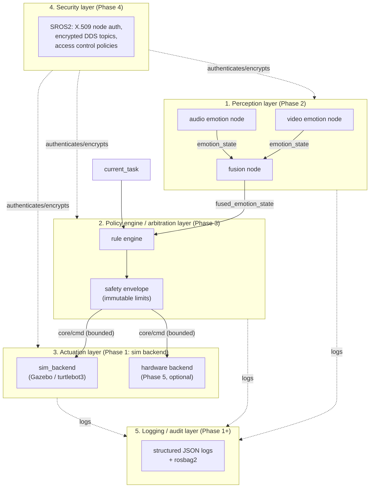

# AffectGuard-HRI

AffectGuard-HRI is a pet-project framework, built on ROS 2, for social/home
robots that adapt their behavior to a person's detected emotional state
(stress, cognitive load) while keeping a hard, non-negotiable safety
envelope between "what the robot perceives" and "what the robot is
allowed to actually do." It is not a kernel or RTOS — "OS" here means a
middleware + security stack on top of Linux, the same sense in which ROS 2
itself is a "robot operating system."

The project exists to demonstrate three things together, not just one:
multi-modal affect recognition (video + audio), a policy/arbitration
layer whose safety envelope cannot be overridden by rules or by a
compromised upstream node, and a security-first treatment of biometric
data in transit (SROS2 node authentication, encrypted IPC, an explicit
threat model, and an audit log of every state transition). Each is
shipped incrementally: see the roadmap below for what exists today versus
what's planned.

This repository currently implements **Phase 1 only**: a ROS 2 skeleton
running in Gazebo simulation, with a placeholder policy engine node and a
sim actuation backend, wired together end-to-end. There is no emotion
recognition, no rule engine, no safety envelope enforcement, and no
SROS2 yet — those are Phases 2 through 4.

## Architecture (5 layers)



Today (Phase 1), only layers 3 and 5 exist in a real form, and layer 2 is
a stub: `core/policy_engine_stub` publishes a fixed forward-drive command
on a timer (no emotion input, no rules, no envelope yet), and
`actuation/sim_backend` forwards it to the simulated robot's `/cmd_vel`.
This still establishes the real topic boundary the later phases build
on: perception and policy nodes only ever talk to `core/cmd`, never to
`/cmd_vel` directly — that separation is what NFR-4 turns into an
enforced SROS2 access-control policy in Phase 4, not just a convention.

## Repository layout

See section 6 of the spec (`docs/decisions/`, ADRs) for the full
rationale. Folders not yet populated with real code carry a short
`README.md` explaining which phase fills them in.

```
affectguard-hri/
├── core/          # policy engine (Phase 1: stub node only)
├── perception/     # emotion recognition nodes (Phase 2)
├── actuation/       # sim backend (Phase 1), hardware backend (Phase 5)
├── security/        # SROS2 keystore/policies (Phase 4)
├── sim/             # Gazebo launch file, Dockerfile
├── docs/            # architecture, threat model, ADRs
├── tests/
├── .github/workflows/
├── docker-compose.yml
└── README.md
```

## Running Phase 1

```
docker compose up --build
```

This builds a ROS 2 Jazzy + Gazebo Harmonic image with turtlebot3, then
runs `sim/launch/affectguard_sim.launch.py`, which brings up:

1. the stock turtlebot3 Gazebo world (unmodified demo robot, per spec —
   Phase 1 deliberately does not invent a custom robot model),
2. `core/policy_engine_stub`, publishing a constant low-speed forward
   command on `core/cmd` every 0.5s,
3. `actuation/sim_backend`, forwarding `core/cmd` to `/cmd_vel`.

Expected result: the robot drives forward in Gazebo. To check without a
GUI: `docker compose exec sim ros2 topic echo /cmd_vel`.

**Known limitation:** this was built and reviewed without a working
Docker daemon / package-index access in the authoring environment, so
`docker compose up` has not actually been executed end-to-end yet. The
ROS 2 distro / Gazebo / turtlebot3 package names in
`sim/docker/Dockerfile` are a best-effort, documented choice (see ADR
0001) rather than a verified one — if a package name or launch file path
is wrong, that's the first thing to check, and it should be a small fix.

### GUI over X11 (optional)

Gazebo's client needs an X11 display. On Linux: `xhost +local:docker`,
then uncomment the `DISPLAY` environment/volume lines in
`docker-compose.yml`. Without it, Gazebo still runs headless inside the
container.

## Roadmap

| Phase | Content | Status |
|---|---|---|
| 1 | ROS 2 skeleton + Gazebo sim, stub policy engine | **this repo, done** |
| 2 | Perception nodes (video + audio) -> `fused_emotion_state` | not started |
| 3 | Real policy engine + enforced safety envelope | not started |
| 4 | SROS2 + threat model + audit log | not started |
| 5 (optional) | Raspberry Pi 5 / Jetson Orin Nano hardware port | not started |

## License

MIT — see [LICENSE](LICENSE).
