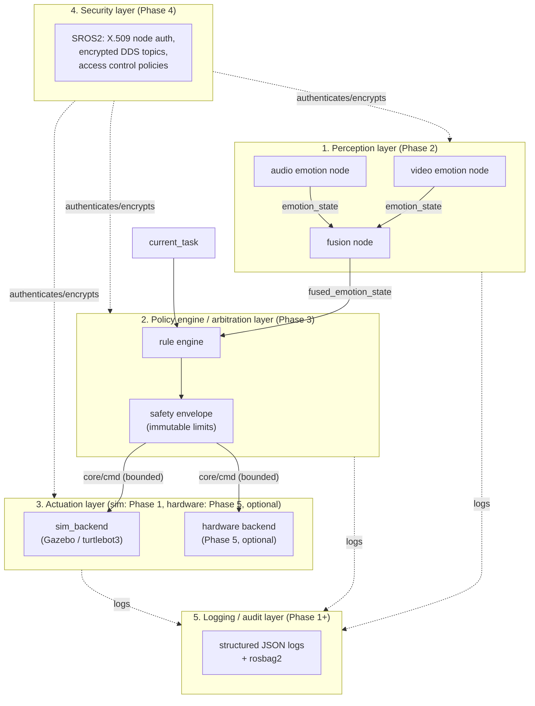

# AffectGuard-HRI

[](https://github.com/oleg-vdv/affectguard-hri/actions/workflows/ci.yml)

AffectGuard-HRI is a pet-project framework, built on ROS 2, for social/home
robots that adapt their behavior to a person's detected emotional state
(stress, cognitive load) while keeping a hard, non-negotiable safety
envelope between "what the robot perceives" and "what the robot is
allowed to actually do." It is not a kernel or RTOS — "OS" here means a
middleware + security stack on top of Linux, the same sense in which ROS 2
itself is a "robot operating system."

The project exists to demonstrate three things together, not just one:
multi-modal affect recognition (video + audio), a policy/arbitration
layer whose safety envelope cannot be overridden by rules or by a
compromised upstream node, and a security-first treatment of biometric
data in transit (SROS2 node authentication, encrypted IPC, an explicit
threat model, and an audit log of every state transition). Each is
shipped incrementally: see the roadmap below for what exists today versus
what's planned.

This repository currently implements **all phases, 1-5**, and the core
loop is verified running end-to-end on a headless server (see "Running
Phase 1 + 3" below): a ROS 2 skeleton running in Gazebo simulation,
real video/audio emotion recognition nodes feeding a fusion node
(`fused_emotion_state`), a rule-based policy engine with an immutable,
unit-tested safety envelope that clamps or zeroes any movement command
before it reaches actuation,
an SROS2 access-control policy that makes perception technically
unable to reach actuation topics, structured JSON audit logging of
every state transition, and an optional real-hardware actuation
backend for Raspberry Pi 5 / Jetson Orin Nano behind the same
`core/cmd` interface and the same launch file. See
`docs/threat-model.md` for the three required threats and their
mitigations, and `docs/hardware.md` for what Phase 5 does and doesn't
assume about your chassis.

## Architecture (5 layers)



As of Phase 5: all 5 layers exist in a real form. `core/policy_engine`
turns the fused emotion label into a movement/voice/face proposal
(`core/rule_engine.py`), which then always passes through
`core/safety_envelope.py` before publishing on `core/cmd` — there is no
code path that skips the envelope. `actuation/sim_backend` forwards the
movement part to `/cmd_vel` and stands in for voice (log) and face
(topic) per FR-3's MVP scope. Perception and policy nodes still only
ever talk to `core/cmd`, never to `/cmd_vel` directly — as of Phase 4
that's an enforced SROS2 access-control policy
(`security/policies/policy.xml`), not just a convention: no perception
enclave has a permission entry for `core/cmd`, `/cmd_vel`, or
`face_indicator` at all. Every node also emits a structured JSON audit
line per state transition (`*/audit.py`'s `audit_log()`), and
`sim/record_audit_bag.sh` records the same topics via rosbag2.

## Repository layout

See section 6 of the spec (`docs/decisions/`, ADRs) for the full
rationale. Folders not yet populated with real code carry a short
`README.md` explaining which phase fills them in.

```
affectguard-hri/
├── core/          # policy engine + safety envelope (Phase 3)
├── perception/     # emotion recognition nodes (Phase 2: video, audio, fusion)
├── interfaces/      # EmotionState / AudioChunk custom messages (ADR 0002)
├── actuation/       # sim backend (Phase 1), hardware backend (Phase 5, optional)
├── security/        # SROS2 keystore/policies (Phase 4)
├── sim/             # Gazebo launch file, Dockerfile
├── docs/            # architecture, threat model, ADRs, models.md, hardware.md
├── tests/
├── .github/workflows/
├── docker-compose.yml
└── README.md
```

## Running Phase 1 + 3 (default)

```
docker compose up --build
```

This builds a ROS 2 Jazzy + Gazebo Harmonic image with turtlebot3, then
runs `sim/launch/affectguard_sim.launch.py`, which brings up:

1. the stock turtlebot3 Gazebo world (unmodified demo robot, per spec —
   Phase 1 deliberately does not invent a custom robot model),
2. `core/policy_engine`, which defaults to a "neutral"/non-critical
   state until real messages arrive, and publishes the corresponding
   (low-stress) `BehaviorCommand` on `core/cmd` every 0.5s,
3. `actuation/sim_backend`, forwarding the movement part to `/cmd_vel`
   (plus logging voice_text and publishing face_pattern on
   `face_indicator`).

Expected result: the robot drives forward in Gazebo at the "calm"
speed. Every node also logs one structured JSON line per state
transition (FR-4), and those logs are the most reliable way to watch
the pipeline — `docker compose logs sim -f | grep policy_engine` shows
the live `policy_decision` stream. In the calm/idle state each line
reads `"fused_label": "neutral" ... "enforced_linear_x": 0.15`.

(Note: ad-hoc `docker compose exec sim ros-env-exec ros2 topic echo ...`
also works, but each exec is a fresh DDS participant that has to
re-discover the graph, so it can be flaky/slow to attach on the first
try — the JSON logs above avoid that entirely. The `ros-env-exec`
wrapper is needed because `docker compose exec` bypasses the image's
ROS-sourcing ENTRYPOINT; see `sim/docker/ros_env_exec.sh`.)

To see the policy engine **react to emotion**, publish a fused emotion
state for a few seconds (a resident publisher, so DDS discovery
completes and the message actually reaches the node) and watch the
log:

```
docker compose exec sim ros-env-exec bash -c \
  "timeout 8 ros2 topic pub /fused_emotion_state interfaces/msg/EmotionState '{label: anger, confidence: 0.9}' -r 2"
docker compose logs sim --tail 4 | grep policy_engine
```

The log now shows `"fused_label": "anger" ... "enforced_linear_x":
0.045` (0.15 × 0.3 for high stress) and `"face_pattern": "concerned"`.

And to see the **safety envelope** refuse to let anything move the
robot during a critical task:

```
docker compose exec sim ros-env-exec bash -c \
  "timeout 8 ros2 topic pub /current_task interfaces/msg/CurrentTask '{task_id: demo, critical: true}' -r 2"
docker compose logs sim --tail 4 | grep policy_engine
```

The log shows `"task_critical": true, "proposed_linear_x": 0.045,
"enforced_linear_x": 0.0` — the rule engine still proposed movement,
but the envelope forced it to zero, regardless of the emotion.

**Verified end-to-end.** All three transitions above were run live on a
headless Ubuntu 24.04 server (`docker compose up --build`, no GUI):
calm → 0.15, `anger` → 0.045, and `critical` task → 0.0 all reproduced
exactly as described, and Gazebo/turtlebot3 came up (its `/scan`,
`/odom`, `/tf`, `/imu`, `/cmd_vel` topics are all present). CI's
`docker-build` job additionally rebuilds the image on every push, so
the apt/pip/colcon build stays verified continuously. Three real bugs
were found and fixed by actually running it — see git history: pip vs.
the base image's debian-managed numpy, `/cmd_vel` needing
`TwistStamped` rather than plain `Twist` on Jazzy, and `xvfb-run`
hanging on a headless host (Xvfb is now started directly). The Phase 4
SROS2 path is the one part not yet exercised on real hardware — see
`security/README.md` — that part (`ros2 security create_permission`
against `policy.xml`) isn't part of the `docker-build` CI job.

## Running Phase 2 (perception)

Perception nodes are **off by default** in the launch file — the
default turtlebot3 model has no camera and there's no bundled
microphone source in sim, and both nodes refuse to start without a
real ONNX model file (see `docs/models.md`). With models in hand:

```
docker compose run --rm sim ros2 launch /workspace/launch/affectguard_sim.launch.py \
    enable_perception:=true \
    video_model_path:=/path/to/emotion-ferplus.onnx \
    audio_model_path:=/path/to/speech-emotion.onnx
```

Then feed it real data — a camera driver node or `ros2 bag play` of a
recorded dataset onto `camera/image_raw`, and an `interfaces/AudioChunk`
publisher onto `audio_raw` — and watch `fused_emotion_state`:
`docker compose exec sim ros-env-exec ros2 topic echo fused_emotion_state`.

## Running Phase 4 (SROS2)

Off by default (`enable_security:=false`) — see `security/README.md`
for the full walkthrough (generating the keystore, the `/test_cli`
enclave for manual testing once security is on). Short version:

```
docker compose exec sim /workspace/security/generate_keystore.sh
docker compose run --rm sim ros2 launch /workspace/launch/affectguard_sim.launch.py \
    enable_security:=true
```

### Headless servers

No GUI needed. If `docker-compose.yml`'s `DISPLAY` lines are left
commented out (the default), the entrypoint starts Gazebo under `Xvfb`
(a virtual display) automatically, so a headless box doesn't depend on
guessing turtlebot3_gazebo's own headless launch argument.

### GUI over X11 (optional)

Gazebo's client needs a real X11 display. On Linux: `xhost
+local:docker`, then uncomment the `DISPLAY` environment/volume lines
in `docker-compose.yml`. When `DISPLAY` is set, the entrypoint skips
`Xvfb` and uses the forwarded display instead.

## Running Phase 5 (optional real hardware)

Same launch file, different `backend` argument — no separate launch
file, per the roadmap's own Phase 5 criterion. Run this on the robot's
own ROS 2 install (colcon workspace) rather than inside the Docker
image built for Gazebo, since GPIO access is simplest from the host:

```
ros2 launch sim/launch/affectguard_sim.launch.py backend:=hardware
```

Defaults to a log-only motor driver (safe anywhere, moves nothing).
For an actual Raspberry Pi differential-drive chassis:
`backend:=hardware hardware_driver:=gpiozero`, with pin numbers/
wheel base/top speed set via a ROS 2 parameters YAML file (these are
per-robot calibration constants, not launch arguments — see
`docs/hardware.md`). Jetson Orin Nano needs its own `MotorDriver`
subclass (`actuation/motor_drivers.py`) since `gpiozero` is
Raspberry-Pi-specific — also covered in `docs/hardware.md`, along with
what is and isn't verified here (there's no physical robot in the
environment that wrote this).

## Roadmap

| Phase | Content | Status |
|---|---|---|
| 1 | ROS 2 skeleton + Gazebo sim, stub policy engine | **done, verified live** (robot drives in Gazebo on a headless server) |
| 2 | Perception nodes (video + audio) -> `fused_emotion_state` | **done** (models not bundled, see `docs/models.md`) |
| 3 | Real policy engine + enforced safety envelope | **done, verified live** (17/17 unit tests + end-to-end emotion→speed→envelope run) |
| 4 | SROS2 + threat model + audit log | **done** (see `security/`, `docs/threat-model.md`) |
| 5 (optional) | Raspberry Pi 5 / Jetson Orin Nano hardware port | **done** (log-only + gpiozero reference driver; see `docs/hardware.md`) |

## Author

Oleg Vdovin (Вдовин Олег)

## License

MIT — see [LICENSE](LICENSE).
